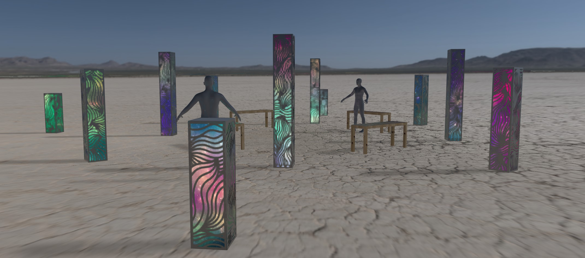

# The Auditorium

### An interactive and immersive showcase of light, spatial music and 3D ambient sound, designed to intrigue and inspire. Wander through an orchestra, lay in the middle of a breaking wave, or surround yourself with swirling piano notes and singing birds.

## Physical Description

#### Construction
- 12 columns, each up to 5 ft tall, placed in a geometric pattern across a wide open space. Each column has a smooth black surface, which appears featureless from a distance. Up-close, swirling patterns reminiiscent of natural phenomena are etched into the surface. By night, the columns glow from within, the light shining through the etchings.

#### Audio
- Each column contains one or more speakers hidden within, which are used to play back specially-created spatial audio - a mix of natural/ambient soundscapes and soft music, which can move around the space in real time.

#### Lighting
- The lights within each column complement and react to the sounds coming from within - for example simulating a campfire, fireflies, or rolling waves to match the soundscape, or creating falling raindrops.

#### Appearance
- Patterns are carved into the surface of each column, evocative of natural phenomena: wings, mountains, leaves, waves, flames. A backing layer of white plastic diffuses the interior light giving everything a soft glow. It aims to be mysterious and intriguing from a distance, yet warm and welcoming up-close.

#### Seating
- Large reclining benches are placed around the piece to allow participants to sit and enjoy the music and lights. The hope is to make this a place where people will want to sit and rest, and that people will want to stay for long enough to see and hear the variety of experiences on offer.

#### Activity
- It is most visually effective at night, acting as a beacon to draw in people from afar. However it is musically active during the day as well.

#### Materials
- The columns themselves are made of an aluminum skeleton with black plastic panels attached to the surface. An inner layer of white plastic diffuses the internal lighting through the etched markings.
- Benches and other seating options are made of plywood.

## Interactivity

- The installation is designed to play a mix of specially created music (piano, orchestra, electronic, ambient, world, and more) and natural soundscapes (the sounds of campfires, forests, birdsong, rolling waves, rain, wind, and so on), all recorded and created specifically for a spatial audio setup. This means individual parts of the audio - whether a single instrument, a single bird, or even a single piano note - can be moved around the space in real time.
- The columns also contain internal addressable LED lighting, which can simulate natural phenomena (glowing fires, flowing water, falling rain) or respond to live music as appropriate.
- A pedestal in the center allows partcipants to select the "mood" of upcoming pieces.
- The piece automatically builds a playlist to suit a given time - perhaps upbeat in the early evening, relaxing late at night, or mysterious in the morning.
- Overall, the piece aims to automatically respond to the people and circumstances around it in whichever way will best provoke reflection, wonder, and intrigue.

## Mission
Inclusion and participation have been at the forefront of my mind while designing this. I want to create a space that is welcoming and inclusive by its very nature - no walls or doors, no entry lines, no center, front, or best spot to be. That inclusivity leads to participation. Everyone who comes close is automatically a participant in the shared experience, and their presence helps to shape the events that unfold.
Some of my favorite experiences with art on-playa have been those where the interactivity of the piece is not immediately obvious, but instead is discovered collaboratively with those sharing the experience through discussion and experimentation - this is something I’d love to foster with this piece.
I hope this can be an experience that provokes fascination and childlike wonder in people who have likely never experienced anything like it.

I’m also leaning heavily on natural influences for this piece. Black Rock Desert can be harsh and unforgiving, and the physical structure is equally stark at first glance. One of the only things I miss while at Burning Man, and the thing I appreciate first when I leave, is exposure to the natural world. We all have an inbuilt kinship with rustling leaves, running water, and birdsong - exposure to these is shown to reduce stress, and the opposite is equally true. Through the use of field recordings, soundscapes, gentle music, and lighting, I’d like to bring a reminder of the softer side of the natural world which can otherwise feel absent from the desert - like an oasis.

The playa can be an overwhelming place at night: loud thumping music and bright flashy lights can be hard to escape. I’d like to create a place of respite, where people feel comfortable slowing down, having space to reflect and feel recharged. this piece showcases a lot of musical genres which are not well represented at Burning Man (Indian classical, Gamelan, West African ensembles, ambient, classical, contemporary piano), all of which bring a different energy and allow people to step outside their usual experience to experience something new.

## Progress so far...

#### Version 1 Complete!
All the hardware, software, lighting and audio needed to get a working piece ready for UnSCruz was completed on time.

#### [UnSCruz (May 2024)](docs/UNSCRUZ24.md)
The Auditorium was placed at UnSCruz (a "regional" burn, like a mini local version of Burning Man).
Lots of good feedback from participants, lots of lessons learned, and a whole list of improvements to make before it goes to Burning Man. 
Pics/video at https://www.instagram.com/oddsockmachine/ 
Unfortunately it was placed in a location where the towers couldn't be secured to the ground, so it was damaged during a big storm that rolled through.

#### [UnSCruz (May 2025)](docs/UNSCRUZ25.md)
Damage fixed, lots of improvements:
- Easier setup (quick connect cable looms)
- UI (easier for participants to choose songs, moods, etc)
- Scheduling/content (more appropriate mix of songs depending on time of day)
- Lighting (new lighting engine, more and better visualizations)
- Placed indoors in the dark, to avoid sound bleed and allow lighting to run 24/7

#### [Burning Man (August 2025)](docs/BURNINGMAN25.md)
Decided that a phone-based UI was inappropriate for the event - it takes people out of the moment
Instead created the center pedestal, allowing people to select a combination of song types and moods to best fit the moment
Setup went smoothly thanks to the two previous outings
A major storm (65mph winds!) tested this (and me) to its limits, but it survived and stayed running for 9 days without interruption