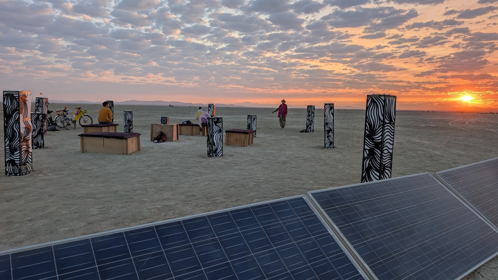
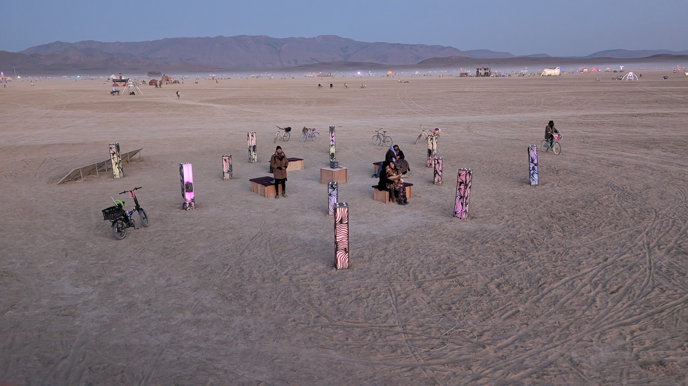
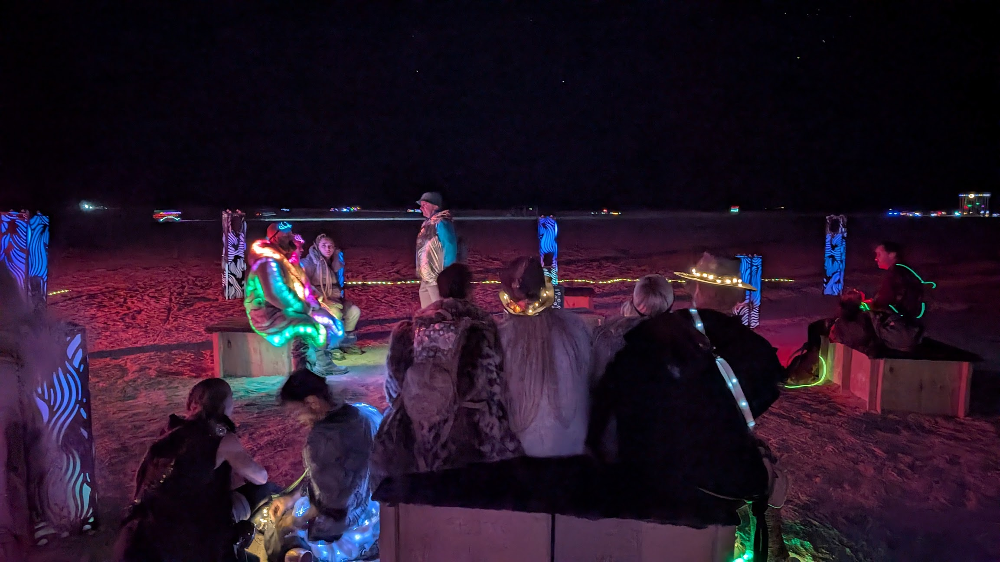
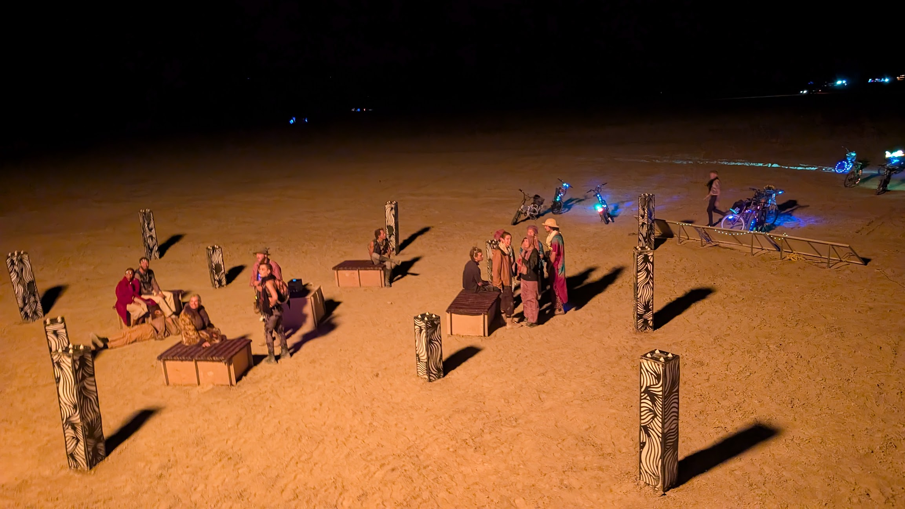
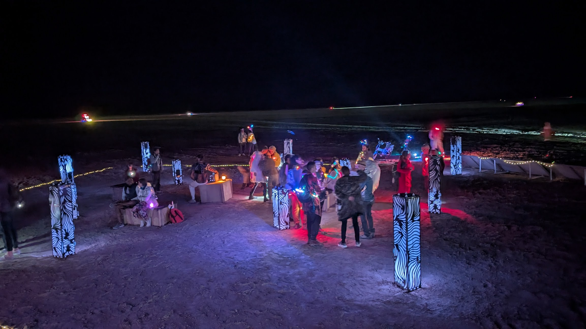
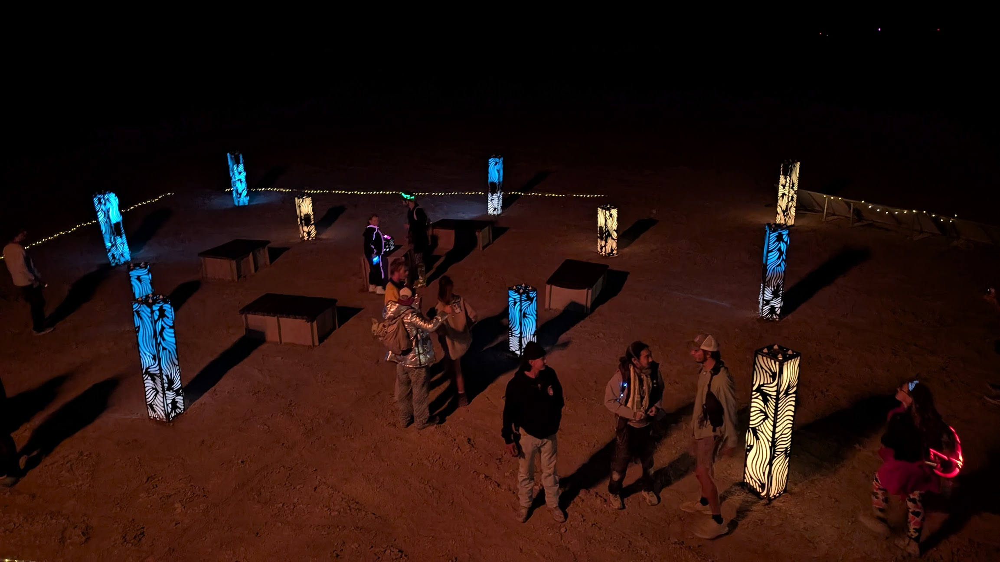

# Burning Man 2025

After 18 months of work, and one aborted attempt, Auditorium made it to Black Rock City!

Installation on-playa was surprisingly easy (thanks in part to countless time-saving measures put in place beforehand).

However, 5 minutes after setup was complete, 65mph winds battered the city.

Auditorium took a reasonable amount of damage - some of the body panels were torn clean off by the wind. Some were found hundreds of meters away, and one was never found! I had used extra large lag screws to secure the columns firmly to the ground, yet the wind eroded the ground away from below them, leaving them tilting.

However, it was repairable, and the next day things were... good enough. Clear packing tape did a wonderful job holding things together.

The internal systems stayed online through the storm and the rest of the event. In total, every service and system had 10 days of continuous uptime.

The solar system also worked flawlessly, providing enough power to keep it running even through 3-4 days of cloudy skies.

I left a wedding-style guestbook on the central pedestal, and by the end of the week it was filled with wonderful messages of thanks, support, and encouragement.

## Lessons learned

- Built version 2 out of metal, and make it big!

- I slightly oversized the solar system, which paid off. In future, I'll oversize even further: more panels and battery capacity to cope with cloudy conditions.

- During the day it's quiet enough that the softer ambient/nature pieces were easily heard. Later at night, the end-cap sound camps drown out all but the loudest of sounds. The soundscapes fared better there, due to their dense harmonic makeup.

- In future, it will be worth upgrading the speaker setup to something more powerful. I had hoped, given the soft nature of many of the audio pieces, that it wouldn't be necessary or appropriate. It seems that creating a higher volume "quiet space" is the only way.

- The lights are relatively underpowered. Although they've been fine indoors and at smaller venues, the vastness of Black Rock Desert makes them barely visible from a distance. I would consider increasing their total power by 50-100% just so the piece can be spotted for further away.

- Diffused lighting means complex patterns and reactivity don't work as well. The softness and gentleness of the existing lighting is pleasant, but I want to experiment with more intricate lighting effects.

## Next steps

Time to design and build [Auditorium V2](AUDITORIUM_V2.md)!

## Pictures

Final sunrise before teardown

Pre-dawn

Late nights

