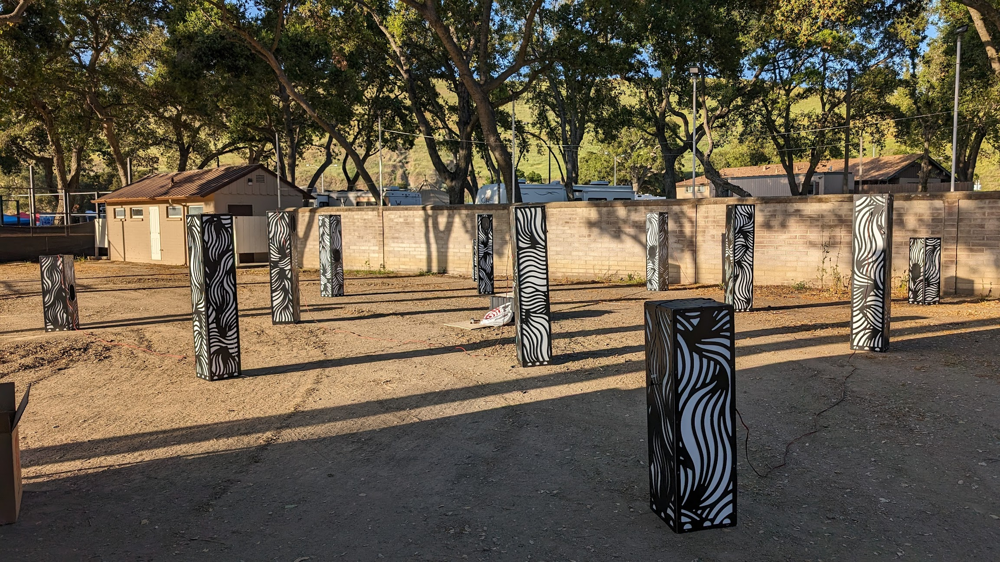
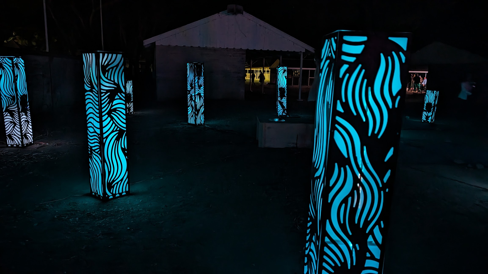
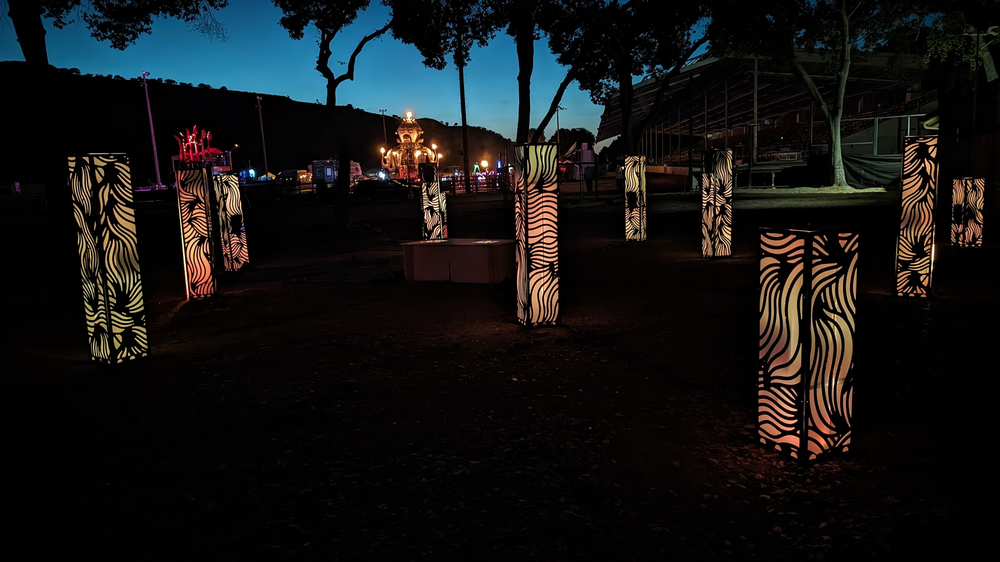
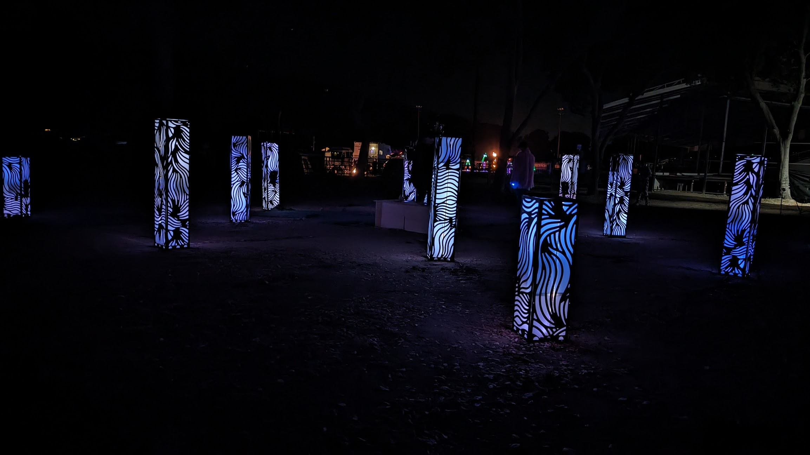
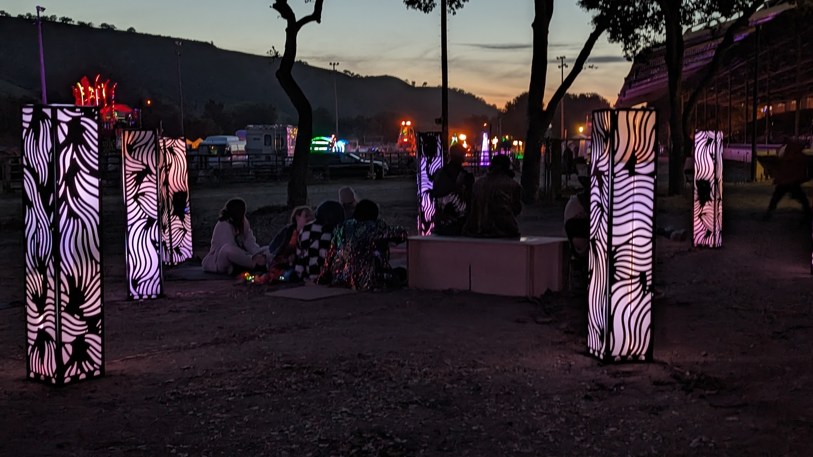
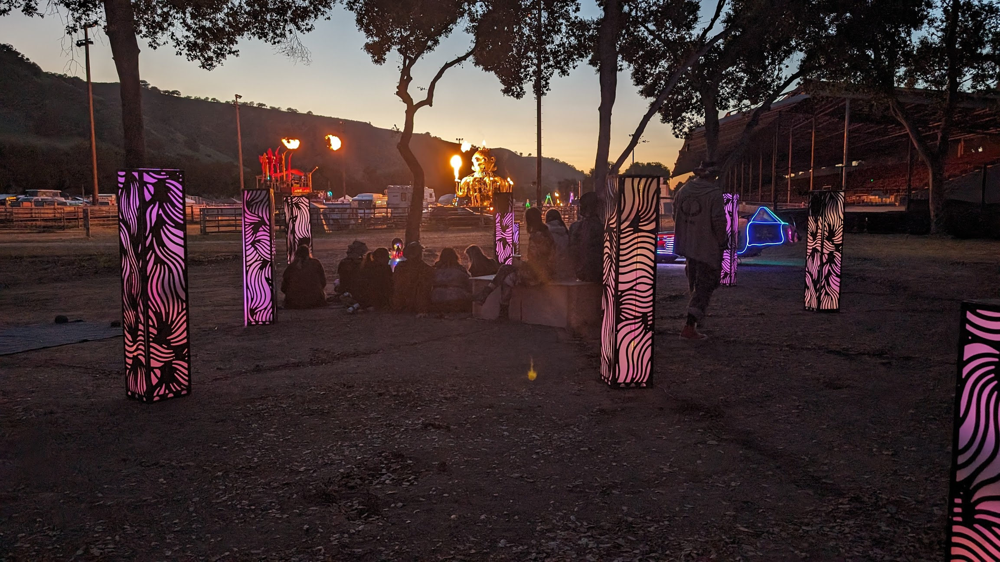
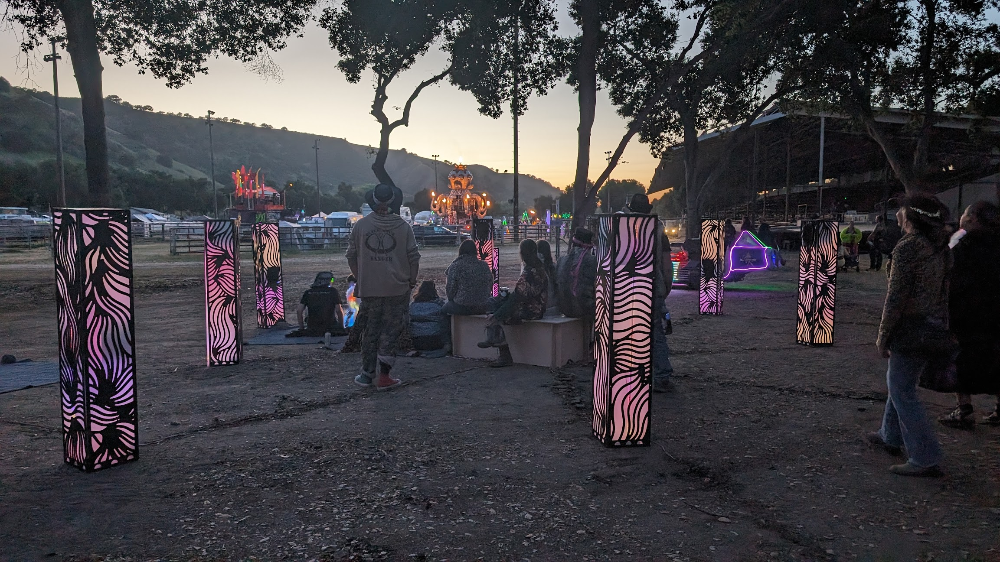
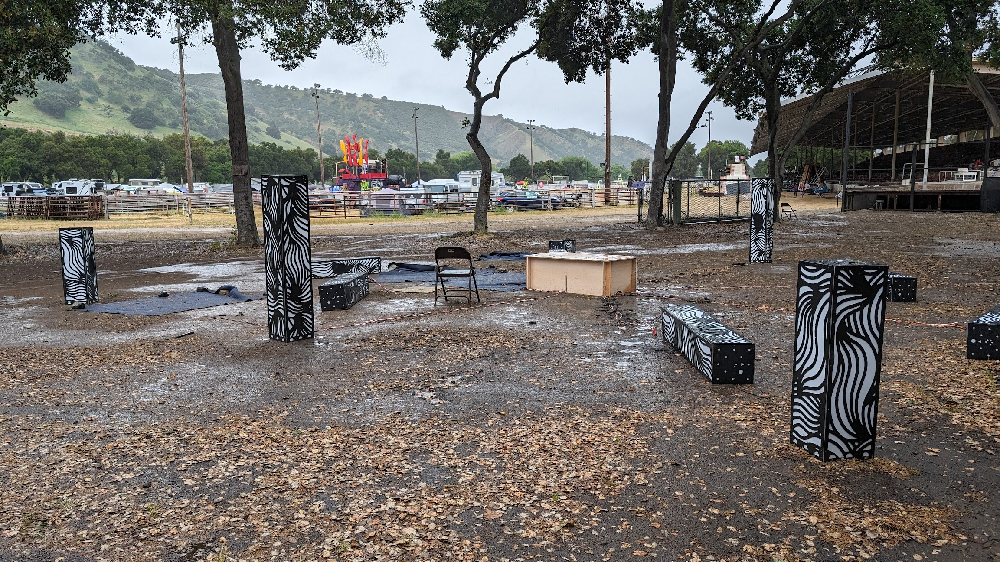

# UnSCruz 2024

## UnSCruz

UnSCruz is a Burning Man "regional", a smaller local version of the big festival.

[Auditorium](AUDITORIUM.md) was invited to the festival in April/May 2024, which I intended to use as a proving ground before bringing it to Burning Man.

It was placed at the edge of the Arena, a large open space for art cars and fire installations.

When installed outside, Auditorium is designed to be lag-screwed into the ground. However, what appeared to be dirt in the Arena was actually 1/4" of dirt on top of hard concrete. As a result, the towers were left free-standing, and the cables could not be trenched.

Amazingly, the columns remained standing on their own, and the other particpants were respectful of them - nothing was knocked over or climbed on.

Unfortunately, mid-event, a large storm blew through and knocked over most of the columns. They sustained only minor damage, and continued working for the rest of the event.

## Lessons learned

This was a good test run, and the first time the installation had been fully setup outside. There were plently of "better next time" moments to learn from:

- It quickly became apparent that connecting every cable up individually (12 columns x LEDs + audio + power) was going to take a long time. Going forward, the cables would be bundled together, pre-attached at each column, with a single set of connections ready to plug in to the central control box.

- Securing the columns to the ground was of course a problem. In lieu of soft ground to lag-screw into, there are now base-boards which increase the stability of each tower such that it can't be knocked over. This is particularly useful for indoor installations.

- There were several software malfunctions, restarts, etc - somewhat inevitable when you let a few thousand people loose on a piece for the first time.

- Being placed in the Arena meant that the big art cars and sound camps would easily overpower the soft sounds and low-power of Auditorium.

- It was a great experience to prove that the whole idea of Spatial Audio works.

## Videos

[Testing - 2D Color Effects](https://photos.app.goo.gl/1yK6G2dft3UPz3Qx8)

## Pictures

