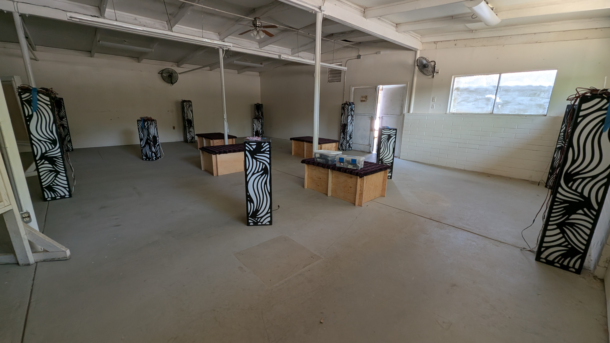
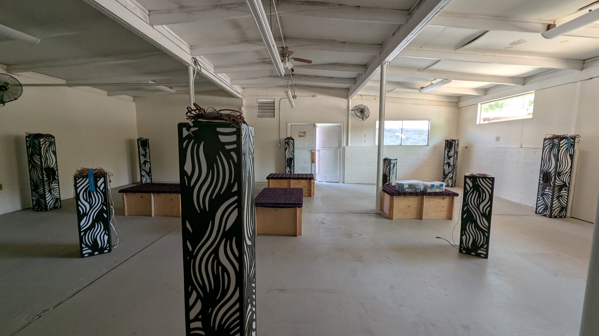
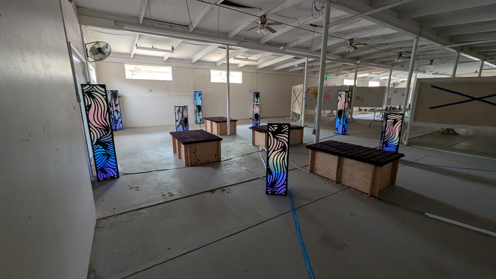
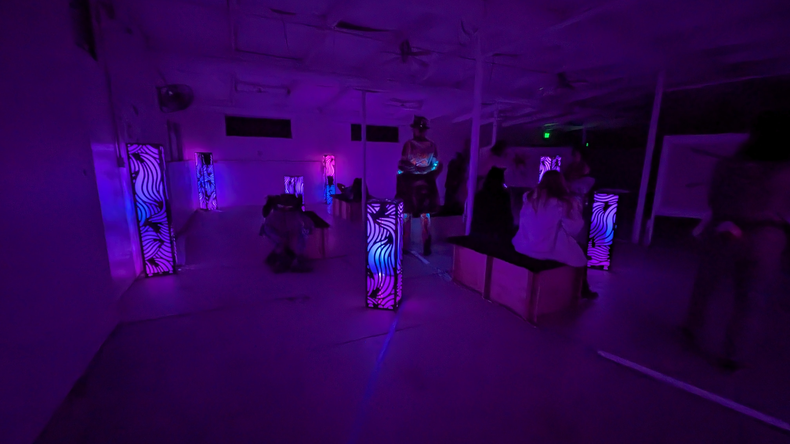
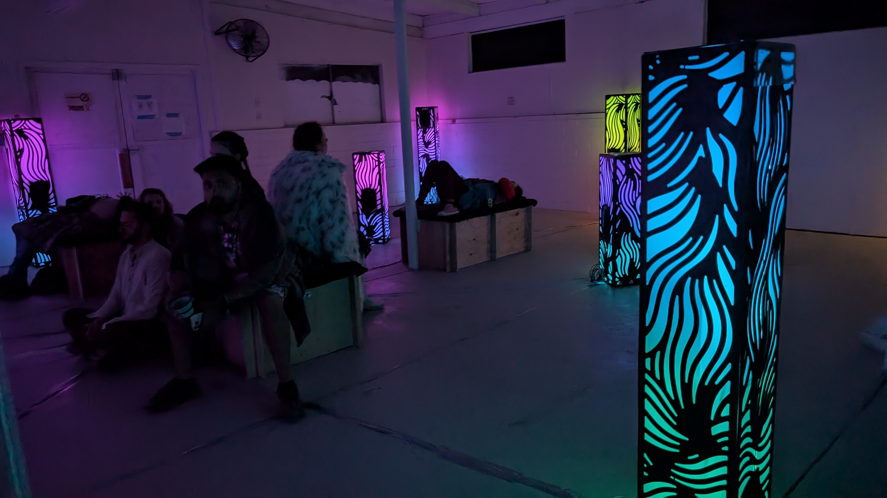
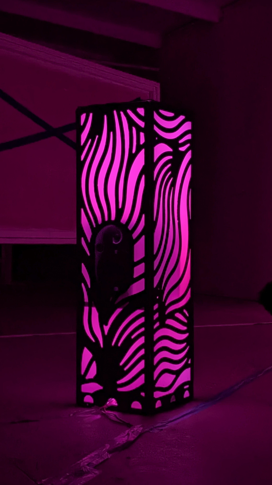
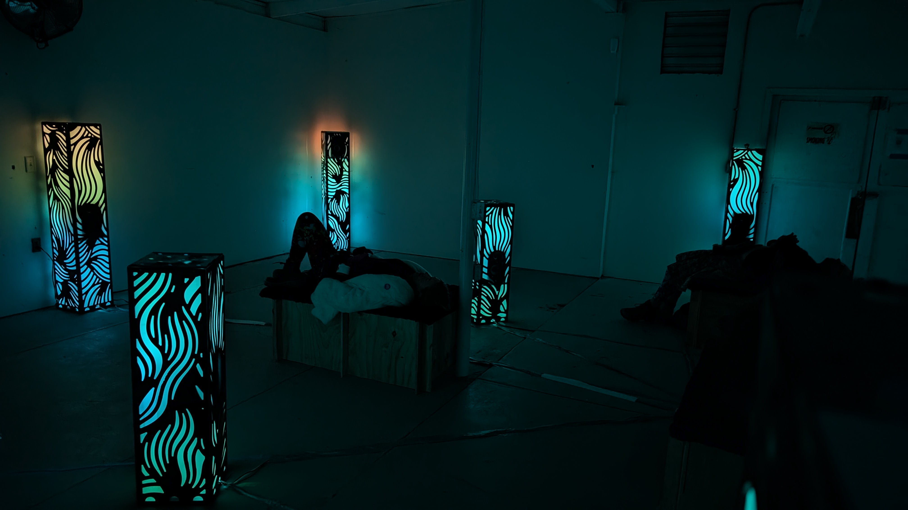

# UnSCruz 2025

## UnSCruz

UnSCruz is a Burning Man "regional", a smaller local version of the big festival.

[Auditorium](AUDITORIUM.md) was invited back for a second time. Knowing it had already been accepted for placement at [Burning Man](BURNINGMAN25.md), this was to be a good trial run.

This year, it was placed indoors, in a warehouse. A much quieter environment, it meant the more delicate sounds could be heard without competiting with large art cars. Not having to worry about the elements was also nice.

This was the first time I was able to test all of the bench seating, which was fully occupied during the busier scheduled events (things like immersive renditions of Dark Side Of The Moon)

## Lessons learned

This was a good opportunity to prove out the improvements I made ready for Burning Man

- Quick connect cable bundles meant setup of the whole installation took barely over an hour

- There were problems with the Wifi Access Point: I never thought to test the installation at home _without_ the home wifi. As a result, some IPs which I considered static actually shifted, meaning people couldn't use the QR codes to access the control website.

- On the other hand, I decided that participants using their phone to control the piece would ruin any sense of immediacy or immersion, especially at Burning Man. Instead, I came up with the "pedestal", a small control box and screen to give people control over the "vibe" of the playlist, without picking individual songs.

## Video
[Einaudi](https://youtube.com/shorts/5cDpeC-Tnq8)
[Pink Floyd](https://youtube.com/shorts/Zzxa6TwU8yM)
[Pink Floyd](https://youtu.be/iMaKmJfkbSM )

## Pictures

Setting up

At night

